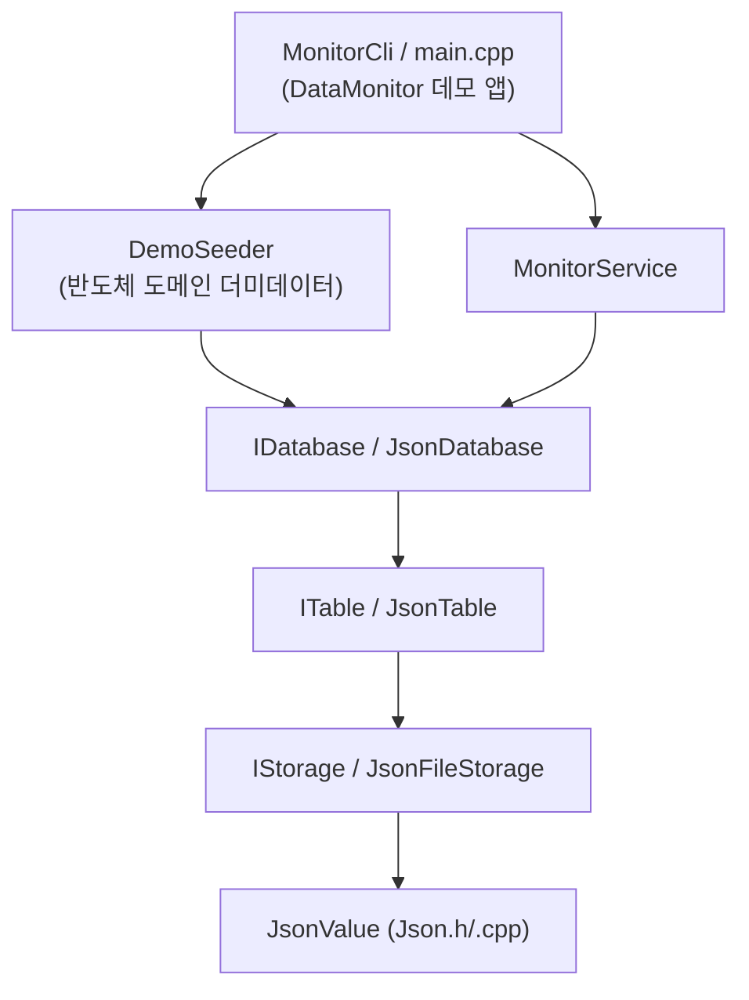

# 아키텍처 문서 (ARCHITECTURE)

## 1. 전체 레이어 구조

이 프로젝트는 아래로 갈수록 더 일반적(generic)이고, 위로 갈수록 더
구체적(specific)인 계층 구조로 되어 있습니다. 반도체 도메인 지식은
가장 위쪽 계층(DemoSeeder)에만 존재합니다.

```
┌─────────────────────────────────────────────────────────┐
│  DataMonitor (콘솔 데모 앱)                                │
│   - main.cpp        : JsonDatabase("./data") 구성, 시딩    │
│   - DemoSeeder       : samples/orders 더미 데이터 (도메인) │
│   - MonitorCli       : 테이블 이름을 몰라도 동작하는 메뉴 UI │
└─────────────────────────────────────────────────────────┘
                          │ uses
┌─────────────────────────────────────────────────────────┐
│  MonitorService  (도메인 무관 파사드)                        │
│   Summary / ListRecords / SearchRecords / AddRecord /      │
│   DeleteRecord                                             │
└─────────────────────────────────────────────────────────┘
                          │ uses
┌─────────────────────────────────────────────────────────┐
│  IDatabase / JsonDatabase                                  │
│   테이블 이름 -> ITable 매핑, "<baseDir>/<name>.json"       │
└─────────────────────────────────────────────────────────┘
                          │ uses
┌─────────────────────────────────────────────────────────┐
│  ITable / JsonTable                                        │
│   레코드 배열에 대한 CRUD + 검색, id 자동 채번               │
└─────────────────────────────────────────────────────────┘
                          │ uses
┌─────────────────────────────────────────────────────────┐
│  IStorage / JsonFileStorage                                 │
│   단일 JSON 문서를 파일로 원자적 저장/로드                    │
└─────────────────────────────────────────────────────────┘
                          │ uses
┌─────────────────────────────────────────────────────────┐
│  JsonValue (Json.h/.cpp)                                    │
│   Null/Bool/Number/String/Array/Object, Parse/Dump          │
└─────────────────────────────────────────────────────────┘
```

Mermaid로 표현하면 다음과 같습니다.



## 2. 왜 이렇게 나눴는가

- **JsonValue**: 모든 계층이 공유하는 데이터 표현. 파서/직렬화기가 여기에만
  있으므로, JSON 포맷 관련 버그는 이 한 파일만 보면 됩니다.
- **IStorage**: "데이터를 어디에 저장하는가"를 추상화. 지금은 파일 하나
  (JsonFileStorage)뿐이지만, 나중에 다른 백엔드(예: 메모리, 네트워크)로
  교체해도 위 계층은 전혀 변경할 필요가 없습니다.
- **ITable**: "레코드 컬렉션에 대한 CRUD"라는 개념을 추상화. 필드 이름조차
  강제하지 않고(예외: id 필드), 어떤 JSON 객체든 레코드로 받아들입니다.
- **IDatabase**: 여러 테이블을 이름으로 관리. JsonDatabase는 디렉터리 내
  `*.json` 파일들을 테이블로 간주해, 디스크 상태와 메모리 상태를 동기화합니다.
- **MonitorService**: 콘솔 UI가 IDatabase/ITable API를 직접 다루지 않고,
  "요약 보여주기", "페이지 단위로 보여주기" 같은 UI 친화적인 동작 단위로
  다시 감싼 파사드입니다. UI 코드가 단순해지고, 다른 프런트엔드(예: 웹 API)를
  붙일 때도 이 파사드만 재사용하면 됩니다.
- **DemoSeeder / MonitorCli(데모 앱)**: 유일하게 "샘플", "발주"라는 단어를
  아는 계층. `ITable`/`IDatabase`/`MonitorService`는 이 두 단어를 몰라도
  동작하며, `MonitorCli`는 `IDatabase::TableNames()`로 테이블을 알아내므로
  다른 도메인의 테이블이 와도 동일하게 동작합니다.

## 3. 확장 지점 (다른 프로젝트에서 재사용하는 방법)

1. `DataMonitorCore`를 정적 라이브러리로 참조합니다 (`DataMonitorCore.vcxproj`를
   프로젝트 참조로 추가하고 `include/` 디렉터리를 추가 포함 디렉터리에 등록).
2. 자신의 데이터 저장 루트 디렉터리로 `JsonDatabase db(path)`를 생성합니다.
3. `db.GetTable("내테이블")`로 원하는 이름의 테이블을 얻습니다. 파일이 없으면
   자동으로 빈 테이블이 생성됩니다.
4. 레코드는 그냥 `JsonValue` 객체입니다. 원하는 필드를 자유롭게 넣고
   `table.Insert(record)`를 호출하면 됩니다 (id는 없으면 자동 생성).
5. 검색이 필요하면 `FindByField` 또는 원하는 조건의 람다를 `Find`에 넘깁니다.
6. 콘솔 UI가 필요하면 `MonitorService`로 감싼 뒤 `MonitorCli`와 같은 형태의
   UI를 새로 작성하거나, 기존 `MonitorCli`를 그대로 재사용할 수 있습니다
   (테이블 이름을 하드코딩하지 않기 때문).
7. 이 라이브러리는 반도체/시료/발주 등 특정 도메인 타입을 전혀 정의하지
   않으므로, 재고 관리, 사용자 관리, 로그 관리 등 어떤 프로젝트에도 그대로
   가져다 쓸 수 있습니다.

## 4. 프로젝트/솔루션 레이아웃

```
DataMonitor.slnx
DataMonitor/                   # 데모 콘솔 앱 (반도체 도메인 예시 소비자)
  DataMonitor.vcxproj
  main.cpp
  DemoSeeder.h / .cpp
  MonitorCli.h / .cpp
DataMonitorCore/                # 범용 엔진 (StaticLibrary)
  DataMonitorCore.vcxproj
  include/datamonitor/
    Json.h
    IStorage.h
    JsonFileStorage.h
    ITable.h
    JsonTable.h
    IDatabase.h
    JsonDatabase.h
    MonitorService.h
  src/
    Json.cpp
    JsonFileStorage.cpp
    JsonTable.cpp
    JsonDatabase.cpp
    MonitorService.cpp
DataMonitorTests/                # 단위 테스트 (ConsoleApplication)
  DataMonitorTests.vcxproj
  TestFramework.h
  main.cpp
  JsonTests.cpp
  JsonTableTests.cpp
  JsonDatabaseTests.cpp
  MonitorServiceTests.cpp
  _test_data/                    # 테스트 실행 중 생성/삭제되는 스크래치 디렉터리
docs/
  REQUIREMENTS.md
  ARCHITECTURE.md
```

## 5. 데이터 파일 형식 예시

`data/samples.json` (JsonTable이 관리하는 레코드 배열):

```json
[
  {
    "id": "SMP-001",
    "name": "8인치 웨이퍼 A타입",
    "avgProductionMinutes": 42.5,
    "yield": 0.973,
    "stock": 120
  }
]
```

배열의 각 원소가 하나의 레코드이며, `id` 필드가 기본 기본키(primary key)
역할을 합니다. 이 형식은 특정 도메인에 종속되지 않으므로, 어떤 필드
구성이든 자유롭게 사용할 수 있습니다.
